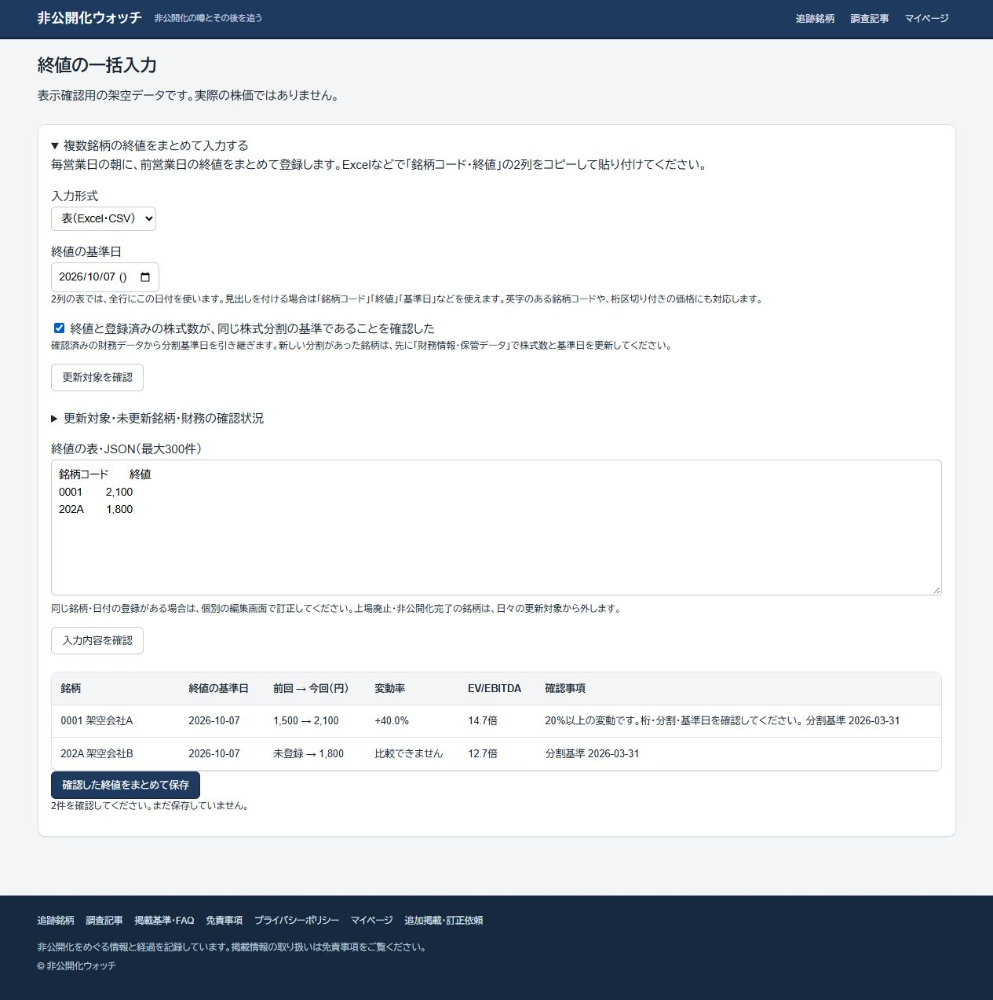

# 終値の一括入力とEV/EBITDAの算定条件

掲載18銘柄の財務について、12か月の実績EBITDAと株式数の分割換算基準を確認した。管理画面で不足していた2項目を保存し、18件を公開対象へ設定。再読込で、既存の数値・対象期・連結範囲・予想一式・出典・注記を変えていないことを照合した。6977・9246の保管財務とTOB比較事例は変更していない。

財務金額の算定根拠と一次資料は [掲載18銘柄の財務入力](MARKET_FINANCIALS_2026_10_07.md) を参照。今回は同調査で保存した決算短信を再読し、実績の対象期間と株式数の分割注記を確認した。株価は新規登録していない。終値を登録すると、公開と同じ計算条件で倍率を確認できる。

## 確認した算定条件

全18銘柄の実績EBITDAは12か月。EVの負債・現金等・調整額・株式数は既存の同一残高日、5項目は既存の同一連結範囲を維持する。分割換算基準日は株価と株式数の単位を照合するための固定日であり、毎日の更新日ではない。

| コード | 実績EBITDAの対象期 | 株式数の分割換算基準日 | 毎営業日の更新 |
|---|---|---|---|
| 4967 | 2025-01-01〜2025-12-31 | 2026-06-30 | 対象 |
| 4320 | 2024-10-01〜2025-09-30 | 2026-06-30 | 対象 |
| 3989 | 2024-10-01〜2025-09-30 | 2026-06-30 | 対象 |
| 4420 | 2025-01-01〜2025-12-31 | 2026-06-30 | 対象 |
| 9072 | 2025-04-01〜2026-03-31 | 2026-06-30 | 対象 |
| 3480 | 2024-11-01〜2025-10-31 | 2026-04-30 | 上場廃止・過去実績を保持 |
| 2540 | 2025-04-01〜2026-03-31 | 2026-03-31 | 上場廃止・過去実績を保持 |
| 9684 | 2025-04-01〜2026-03-31 | 2026-03-31 | 対象 |
| 7630 | 2025-03-01〜2026-02-28 | 2026-02-28 | 対象 |
| 4812 | 2025-01-01〜2025-12-31 | 2026-01-01 | 対象 |
| 7600 | 2025-04-01〜2026-03-31 | 2026-06-30 | 対象 |
| 3593 | 2024-04-01〜2025-03-31 | 2025-12-31 | 上場廃止・過去実績を保持 |
| 202A | 2024-04-01〜2025-03-31 | 2025-03-31 | 上場廃止・過去実績を保持 |
| 7092 | 2024-04-01〜2025-03-31 | 2025-12-31 | 上場廃止・過去実績を保持 |
| 6058 | 2025-03-01〜2026-02-28 | 2026-05-31 | 対象 |
| 9640 | 2025-04-01〜2026-03-31 | 2026-06-30 | 対象 |
| 4216 | 2025-04-01〜2026-03-31 | 2026-03-31 | 対象 |
| 4847 | 2025-07-01〜2026-06-30 | 2026-06-30 | 対象 |

4812は残高日2025-12-31の短信が、2026-01-01の1対3分割後へ換算した株式数を掲載している。[決算短信PDF2頁](https://pdf.irpocket.com/C4812/YpwX/Bm8F/DyEm.pdf)を確認し、基準を残高日へ機械的にそろえず2026-01-01とした。9072は2024-10-01の1対2分割、9684は2025-10-01の1対3分割後の株式数を保持する。202Aなど上場廃止済み銘柄の過去実績へ、非公開化後の併合株式数を混ぜない。

7092は会社公表EBITDAの定義を維持する。その他EV調整額0は追加調整を省くサイトの計算方針であり、非支配持分等の残高が0という意味ではない。4銘柄の通期末残高や13銘柄の会社予想一式も従来の条件を保持する。

## 毎営業日の入力

1. 管理画面の「株価」から「複数銘柄の終値をまとめて入力する」を開く。
2. 基準日を確認する。初期値は日本時間で前営業日。2026・2027年のJPX休場日に対応する。
3. 「更新対象を確認」で公開銘柄の最後の終値・財務の確認状況・未入力銘柄を確認する。上場廃止・非公開化完了の5銘柄は日々の入力から除外する。
4. Excelなどで証券コードと終値の2列をコピーして貼り付ける。終値と登録済み株式数が同じ分割後の単位であることを確認し、チェックを入れる。
5. 「入力内容を確認」で前回→今回の終値、前回比、実績EV/EBITDAと分割基準を照合する。20%以上の変動には確認の案内を表示する。前回値の分割基準が未確認・異なる場合は、前回比を計算しない。
6. 「確認した終値をまとめて保存」を押し、保存後に「公開処理」で再ビルドする。保存だけでは静的な本番ページは変わらない。

架空の表の例。Excelからコピーすると列間はタブになる。

```text
銘柄コード	終値
0001	2,100
202A	1,800
```

見出しなしの2列、引用符付きCSV、英字コード、全角、価格の桁区切り・円表示、行ごとの基準日にも対応する。見出し付きの場合は「銘柄コード」「終値」、任意の「基準日」「分割基準日」「案件ID」を使う。JSON形式も選択でき、従来の出典名・注記を保持する。

最大300行。表では今日以降の終値・休場日・不正な数値・入力内の重複・既存日付・最新登録より古い日付・未確認の分割基準を拒否する。過去の終値の追加や既存値の訂正は個別編集へ戻る。新しい株式分割があったときは、株式数と換算基準を先に更新し、価格の単位も確認する。日付だけの変更で倍率を合わせない。

確認後に入力・日付・形式・チェックを変更すると、保存の確認を取り消す。保存直前にも公開財務・最新終値・銘柄の公開状態・上場廃止状態を再読込する。DBの一括保存は既存の管理者限定RPCを使い、重複時は全件取消。通信失敗時は入力を保持し、保存結果が不明なら一覧の確認を促す。保存後の再読込だけが失敗した場合は保存済みと伝え、再送を促さない。

履歴が1000行を超えても最新の終値を取りこぼさないよう、銘柄ごとに直近2行を読む。手入力JSONで当日の値が保存されている場合も、表示用の前営業日以前の値を選べる。

## 検証と反映

18財務の再読込と既存項目の一致を確認済み。表の解析、倍率・変動率、分割不一致、取得失敗、競合、入力保持、旧JSONの維持、管理者権限と全件取消を自動テストで確認する。画面は通常幅と390px指定（描画幅375px）で確認し、本文の横はみ出しなし、表内の横スクロール、休場日の拒否、架空データ2件の保存成功を確認した。画面確認用の仮ページは削除済み。



[スマートフォンの表示・架空データ](images/daily-price/table-mobile.jpg)

新しいSQL・有料契約・株価の自動取得・定期実行は追加していない。終値の無料取得と公開再配信の許諾を別々に確認する方針を維持する。既存の基準不明の終値に確認済みという印を補う操作は行っていない。確認できる終値を入力するまでは、未登録・分割基準未確認の銘柄の倍率は算出待ちになる。

本番への画面反映と公開財務の照合は、PRマージ・再ビルド後に記録する。
