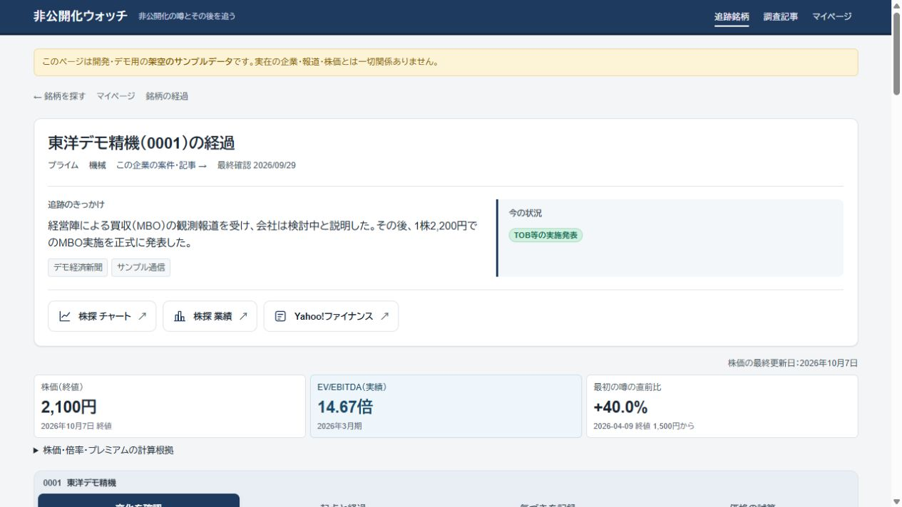
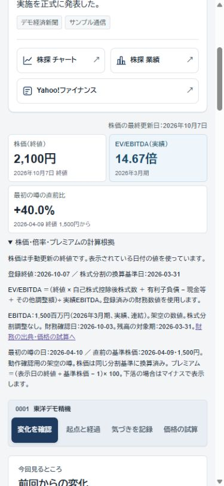
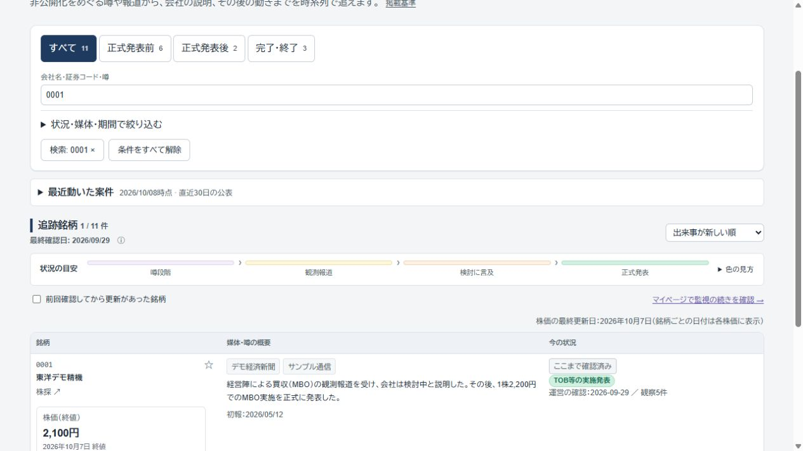
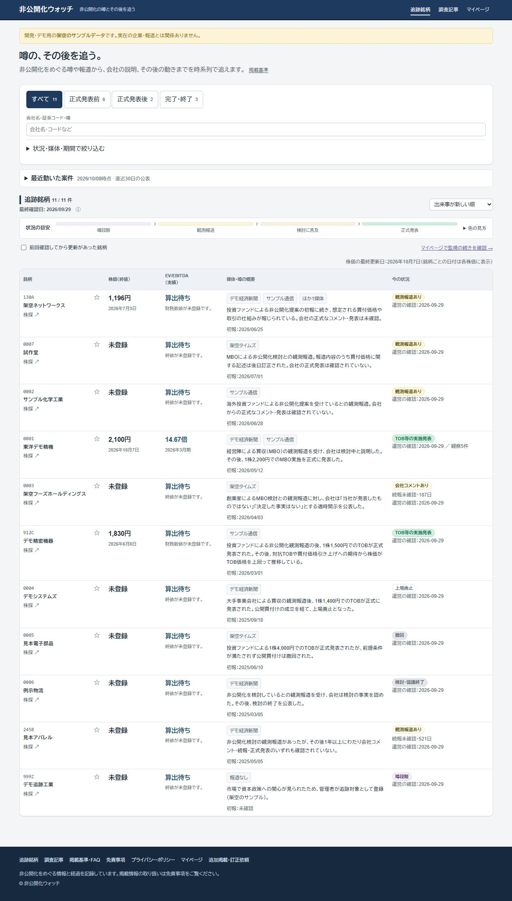
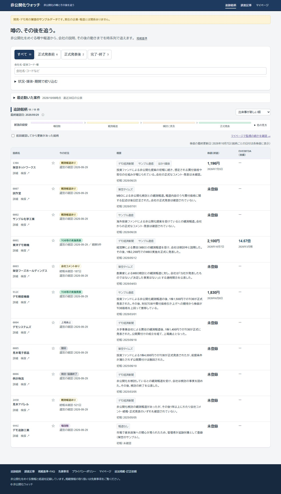
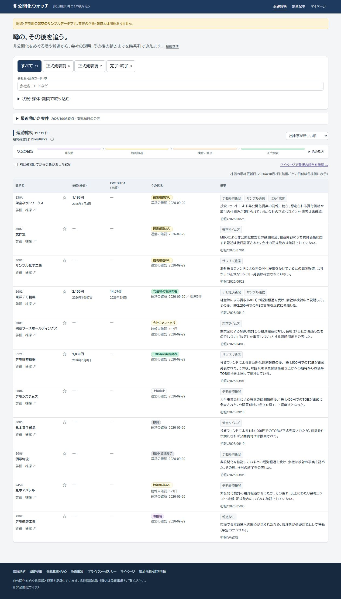
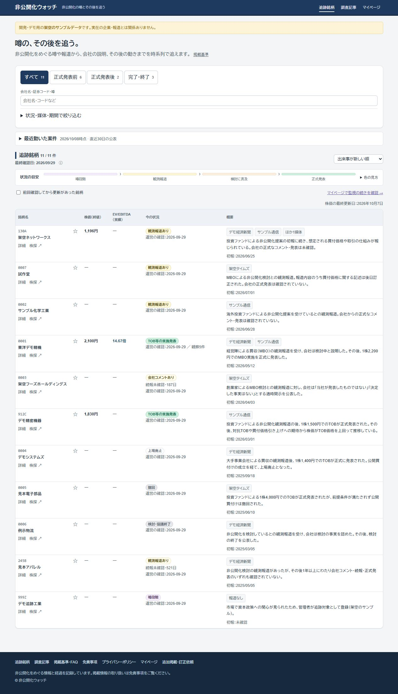
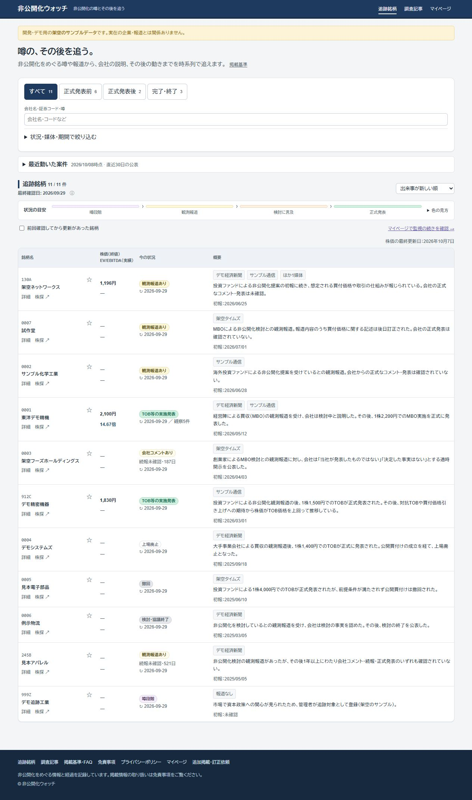

2026-10-08の配置調整：一覧の銘柄名・株価／EV/EBITDA・今の状況は各行に対して縦中央揃えにする。概要は上揃えを維持する。

2026-10-08の最新指定：一覧は「銘柄名→株価・EV/EBITDA→今の状況→概要」の4列。株価と倍率を同じ列の上下に表示する。「運営の確認」は↻に置き換え、状況欄を17%へ縮小。日付・対象期は数値セルに戻さず、時価総額・PBRの追加はしない。

2026-10-08の最新調整：一覧の株価・EV/EBITDA列を6rem・7remへ縮め、余った幅を概要へ回す。トップの各セルでは終値の日付・EBITDAの対象期を表示しない。株価の最終更新日は表右上に集約し、銘柄ごとの基準日・対象期は詳細ページで確認する。

2026-10-08の最新一覧指定：列順を「銘柄名→株価→EV/EBITDA→今の状況→概要」に変更。株価・倍率の未登録／未算出は薄い「ー」。数値は銘柄名と同じ太さ・文字サイズに揃える。詳細・株探のリンクは維持する。

2026-10-08の追加調整：一覧の列順は「銘柄名→今の状況→概要→株価→EV/EBITDA」。銘柄名の下に「詳細」「株探」を左から並べ、詳細は従来の案件URLへリンクする。倍率が未算出の場合は薄い「ー」だけを表示する。

# 終値と市場倍率の手動更新

## 表示と今回の範囲

2026-10-08の一覧調整：株価・EV/EBITDAを銘柄名の下から独立した列へ移し、5列の一覧にする。スマートフォンでも2指標を横並びにする。「今の状況」から個人の確認済みタグを外す。

トップは従来の検索付き一覧、「続きから確認する」はマイページに維持する。一覧と詳細で株価（終値）・実績EV/EBITDAを表示し、詳細だけに「最初の噂の直前比」を加えた。価格の試算は市場プレミアム・EV/EBITDA・実質NAVの補助欄を維持する。過去TOBの掲載は保留とし、保存済みデータは残す。同業比較は必要に応じて既存の記事機能で作成・関連付ける。今回、比較DB・自動記事生成・株価自動取得は追加していない。

ユーザーは株価の取得元表記を必須にせず、入力・表示機能を先に実装するよう指示した。株価の出典名は任意で、公開画面には出さない。これは取得元の規約や転載許諾について新たに判断した記録ではない。出典名は既存の公開データ構造に残るので秘密情報を入力しない。財務の一次資料・対象期・連結範囲・実績／予想の区別は従来どおり残す。

## 営業日ごとの更新

2026-10-11から、初期の入力形式をExcel・CSVの表へ変更した。基準日を確認し、「銘柄コード・終値」の2列を貼り付け、分割基準の確認後に倍率・変動率を確認して一括保存する。未入力の一覧と確認済み財務からの基準引継ぎを追加。以下のJSON入力も形式を切り替えて引き続き使える。18銘柄の補完と新しい手順は [EV_DAILY_UPDATES_2026_10_11.md](EV_DAILY_UPDATES_2026_10_11.md) を参照。

1. 終値を調べ、株価の基準日と円単位の値を確認する。
2. 管理画面の「株価」で個別に登録するか、「複数銘柄の終値をまとめて入力する」を開く。
3. 下の形式でJSONを貼り付け、「入力内容を確認」で銘柄名・日付・価格を照合する。内容を変えたら再確認する。
4. 「確認した終値をまとめて保存」を押す。同じ銘柄・日付が登録済みなら全件を取り消し、既存行の編集へ戻る。通信エラー時は再送前に一覧を再読み込みし、保存済みか確認する。
5. 保存内容を確認して「公開処理」で再ビルドする。保存だけでは静的な公開ページは変わらない。

架空の入力例：

```json
[{"code":"0001","date":"2026-10-07","price":2100,"shareBasisOn":"2026-03-31"}]
```

最大300件。必須はcode・date・price。複数案件のある銘柄はcaseIdで区別する。sourceName（出典の控え）・note（公開注記）・shareBasisOn（分割換算基準日）は任意。ただし換算基準が未確認の場合、倍率とプレミアムを表示しない。株価は正数・小数2桁まで、未来日・不正日付・既知の休業日は保存前に拒否する。

## 株価の最終更新日

「前営業日」の固定表示は使わない。一覧表の上には掲載対象銘柄の終値で最も新しい日付を、詳細の右隅にはその銘柄の終値の日付を「株価の最終更新日：2026年10月7日」の形式で表示する。これは終値の基準日であり、管理画面で保存した日時ではない。銘柄ごとの基準日は詳細ページに表示する。未登録は未登録のままにする。

当日・未来の値は直前営業日までの終値表示に混ぜない。日付判定には日本時間と[JPX休業日](https://www.jpx.co.jp/corporate/about-jpx/calendar/index.html)の2026・2027年分を使用する。2028年以降は取引所の公表に合わせてtradingCalendar.tsを更新する。範囲外では営業日を推測せず、当日より前の登録終値と実際の日付を表示する。

## EBITDAとEV/EBITDA

「財務情報・保管データ」で既存の財務を編集し、下書き保存・公開対象への設定を行う。実績EBITDA、有利子負債、現金等、その他EV調整額、自己株式控除後株式数を共通利用する。財務JSONの金額は円、管理画面の入力欄は各ラベルの単位に従う。EPS・PER・PBRの表示は復活させない。

EBITDAの対象月数を12、株式数の分割換算基準日を終値と同じ日に設定する。換算基準日は保存日ではなく、株価・株式数をどの分割後の単位にそろえたかを示す日付で、分割等がなければ毎日変更しない。分割時には終値・株式数・噂前株価を同一の単位へ直し、必要な注記を残す。基準日だけ合わせて異なる単位の数値を使わない。

EV/EBITDA ＝（終値 × 株式数 ＋ 有利子負債 − 現金等 ＋ 調整額）÷ 実績EBITDA。

会社開示のEBITDA、または営業利益と減価償却・償却費から構成を明示して算出した値を登録する。対象期間・連結範囲を照合し、四半期値を機械的に年率換算しない。12か月の実績、既存の財務整合条件、株式数との分割基準が確認できない場合は理由付きで算出待ちにする。銀行・保険・証券・金融業や、EBITDAまたはEVが0以下の場合も倍率を出さない。

財務JSONの部分取り込みでEBITDA・株式数を変えた場合、対象月数・換算基準日の再指定がなければ旧補足を引き継がない。旧財務データを削除せず、確認してから補足を追加する。実銘柄の終値・基準株価・補足項目は今回新規登録していない。

## 最初の噂の直前比

株価の種類で「最初の噂の直前終値」を選び、最初の噂の日、直前営業日、終値、分割換算基準日を登録する。複数起点のどれを最初の噂としたかは注記で説明する。従来の「報道前終値」を自動的に代用しない。

プレミアム ＝（表示日の終値 ÷ 噂直前の終値 − 1）× 100。小数1桁で、上昇は+40.0%、下落は-20.0%のように表示する。最初の噂の日・日付関係・分割基準が未確認の場合は算出待ち。価格の試算ではこの基準株価を選択できる。

## 変更・検証・公開の区別

SQL0021はprice_snapshotsの任意項目、新しい価格種別、管理者限定の一括登録関数、入力検証を追加する。既存行・既存SQL・メモRLS・認証・お気に入り・フォントを保持する。一括保存は全件成功か全件取消。SQL0020・0021は今回本番へ適用していない。公開時は既存の自動DB更新を使用する。

単体・DB・画面操作のテストを実施。架空の終値2,100円、実績EBITDA15億円、株数1,000万株、有利子負債20億円、現金10億円で14.67倍、噂直前1,500円から+40.0%を確認。祝日・日本時間、欠損・12か月以外・分割不一致・負のプレミアム、管理者権限、重複時の全件取消、入力変更後の再確認、通信失敗時の入力保持を検証する。ブラウザーでは通常幅／390px、検索、日付、計算根拠と横はみ出しを確認する。

最新の結果・PR・本番状態は[PROGRESS.md](PROGRESS.md)を参照。







最終の一覧配置（株価と倍率を独立列へ変更）：











