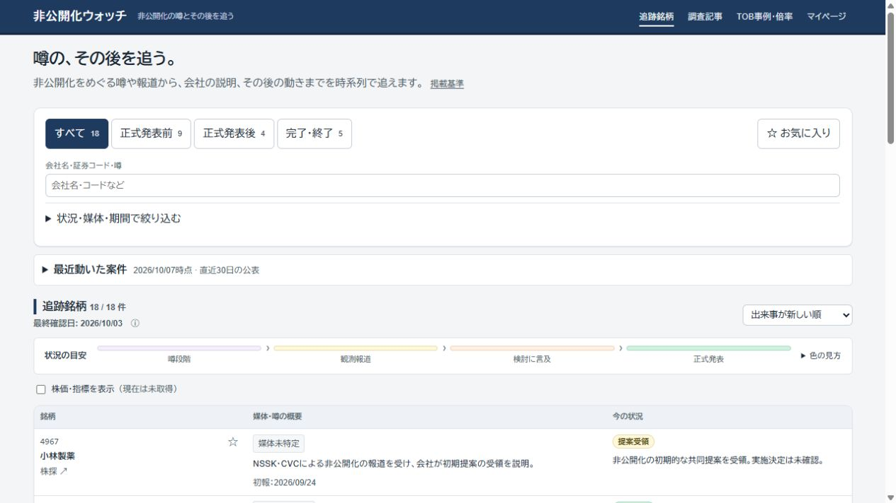
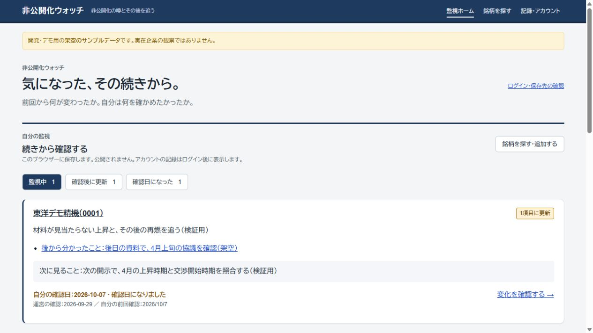
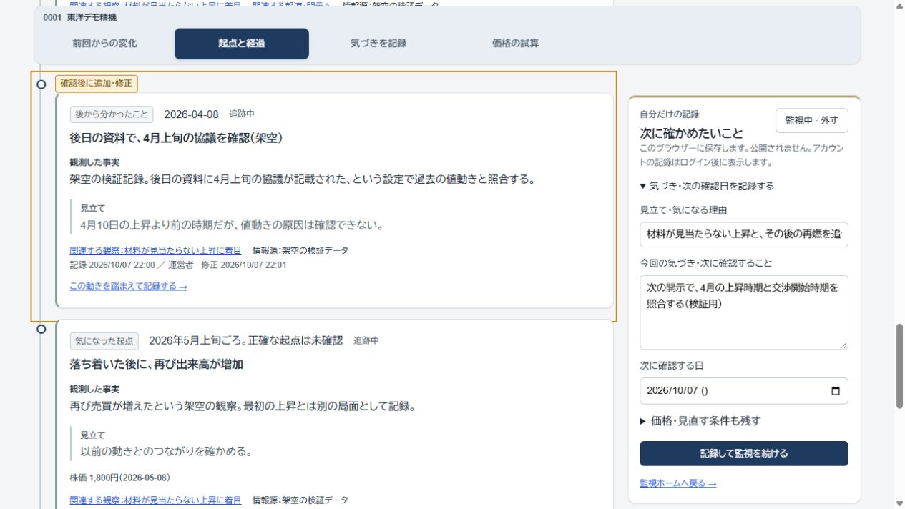

# 継続監視を中心にした画面の再構成

## 置き換えた体験

着手時の本番は18銘柄の検索一覧がトップで、過去TOBへの主要リンクも残っていた。PR #95は未マージで、本番との不一致があった。一方、PR内も一覧・マイページの確認済みリスト・詳細末尾のメモが別々で、再訪から記録までがつながっていなかった。未反映と設計上の不足を分け、後者を今回置き換えた。

| 場面 | 変更前 | 変更後 |
| --- | --- | --- |
| サイトを開く | 全銘柄を検索し、関心のある銘柄を探し直す | 監視ホームに自分の理由、更新した記録、次の確認日をまとめる |
| 銘柄を読む | 報道と観察を別々に読む | 同じ経過へ統合。発生日と記録日を区別し、更新箇所へ直接移動する |
| 気づきを残す | 詳細の末尾でメモを編集する | 経過の横で理由・気づき・次の確認日を保存する。スマートフォンでは経過の手前に記録欄を置く |
| 再訪する | 全体を読み直す | 追加・訂正・取り下げと確認日をホームで見て、続きから読む |
| 価格を考える | 比較・試算が主要機能として並ぶ | 詳細の補助欄から「価格の試算」を開く。三方式と自由入力に限定する |

検索は `/stocks/` に移した。既存の検索クエリ付きトップURLは検索画面へ引き継ぐ。記事は銘柄の経過に関連付けて参照できる。旧TOB詳細・PER/PBR試算は公開せず、保存データと管理機能を保管する。監視案件の交渉時期・正式価格・最終結果は引き続き経過に残す。

## 画面の比較

変更前の本番（2026-10-07、未反映の旧構成）：

変更後のローカル。架空の観察を追加した後、監視ホームから更新箇所へ進める：

発生日が4月の観察を10月に記録。以前の起点へつなぎ、自分の記録を隣で編集できる：

旧ローカル画面と新ローカル画面を同じ約605px幅で比較した画像も保存： [旧画面](images/watch-workspace/before-local-home.jpg) / [変更後](images/watch-workspace/after-local-home.jpg)。390pxでの操作も別途確認した。画像は実画面の取得結果で、デザイン案ではない。

## 保存先と運営

- ログイン中の監視は既存のお気に入り、気づきは既存の本人用メモへ保存する。関心度・過去の自由メモ・構造化メモを引き継ぐ。本人限定RLSは変更しない。
- 未ログイン時はこのブラウザーへ保存する。ログインしても匿名記録を自動でアカウントへ移さない。監視解除でメモを削除しない。確認した内容の比較基準はブラウザー単位で最大300銘柄。
- 通信・保存失敗を成功として扱わず、別アカウントへの切替では前の個人記録を画面から消す。同じアカウントの認証通知では編集中の入力を消さない。端末同期・通知は追加しない。
- 公開観察は既存の管理者用下書き・承認・公開処理を使う。詳細から対象銘柄の観察入力へ進める。人間の手入力とAI整理JSONの両方に対応する。個人メモは公開観察にならない。
- 過去TOBの管理機能は「保管データの管理」へまとめ、日常の観察追加から外した。ニュース収集Action・Discord通知の停止を維持する。

## 検証と反映

ローカルの実ブラウザーで、初回の監視・理由保存 → 観察エディターで架空記録を追加 → サンプルへ反映して再ビルド → 再訪ホームの1件差分 → 更新箇所と以前の起点 → 気づき・確認日更新 → 読了 → ホームの差分0件と記録維持、を確認した。公開反映の代わりにローカルサンプルを使い、本番へ架空の観察を書き込んでいない。

複数の起点で市場プレミアムを切り替え、1,700円・30%で2,210円、1,800円・30%で2,340円。登録財務のEV/EBITDAは8倍で1,100円、NAVは調整なしで1,000円。報道も株価も未登録の999Zでも手入力1,000円・30%で1,300円を計算し、個人の理由を保存してホームの監視2件へ反映できた。

196テスト成功。保存失敗・別タブの上書き・アカウント切替、既存メモ保全、観察のDB承認・記録日時保護・RLS、追加後の再訪から読了までの画面部品テストを含む。型検査と34ページのビルド、静的成果物・CSP・秘密非出力検査も実施。既存のフォント設定を維持し、ux-writingとnatural-japaneseで文言を点検した。

本番マージとSQL0020適用は未実施。実アカウントのGoogleログイン・本番メモ再保存は今回再実行していない。前回の18銘柄・107出来事のローカル確認は [観察履歴の記録](WATCH_HISTORY_2026_10_07.md) に分けて残す。今回の再構成による追加SQLはなく、SQL0020は通常のmain公開フローでサイト公開前に適用する。PR・CIの最新状況はPROGRESS.mdを参照。
